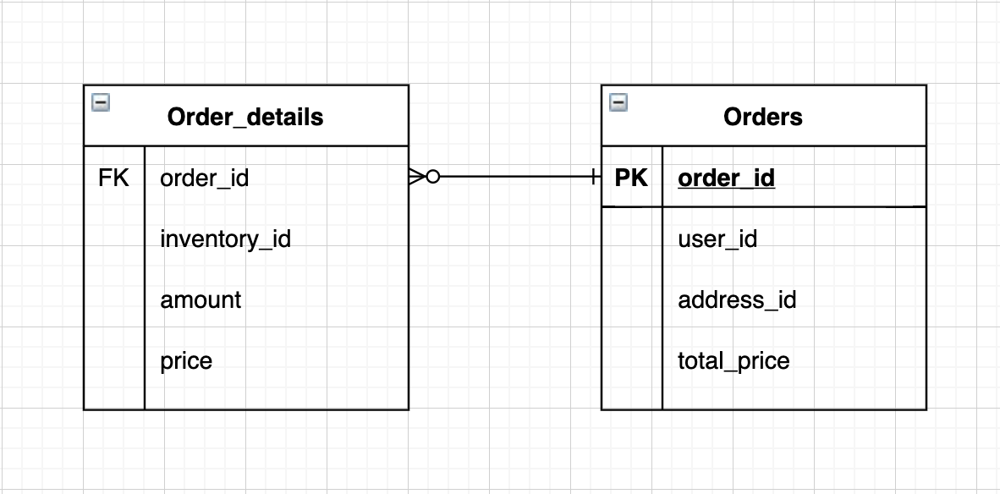

# online-store
#### API Paths
> /orders (GET, POST)
> /orders/<order_id> (GET)

#### Database
> database design for online orders
> 
>
> Find sql script for creating the tables in ./SQLScripts

#### Request message examples for POST
> /orders (POST)
>
    {
        "user_id": 3,
        "address_id": 3,
        "total_price": 59.98,
        "inventories": [
            {
                "inventory_id": 1,
                "amount": 2,
                "price": 29.99
            }
        ]
    }